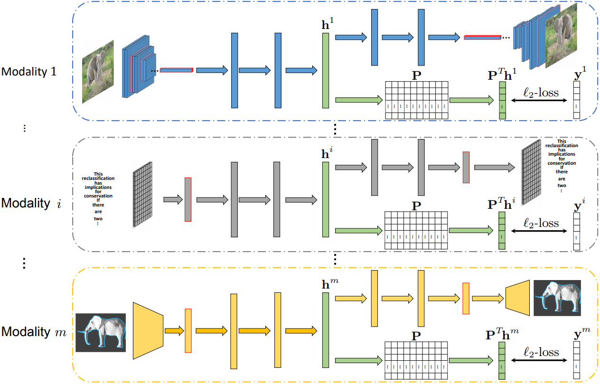
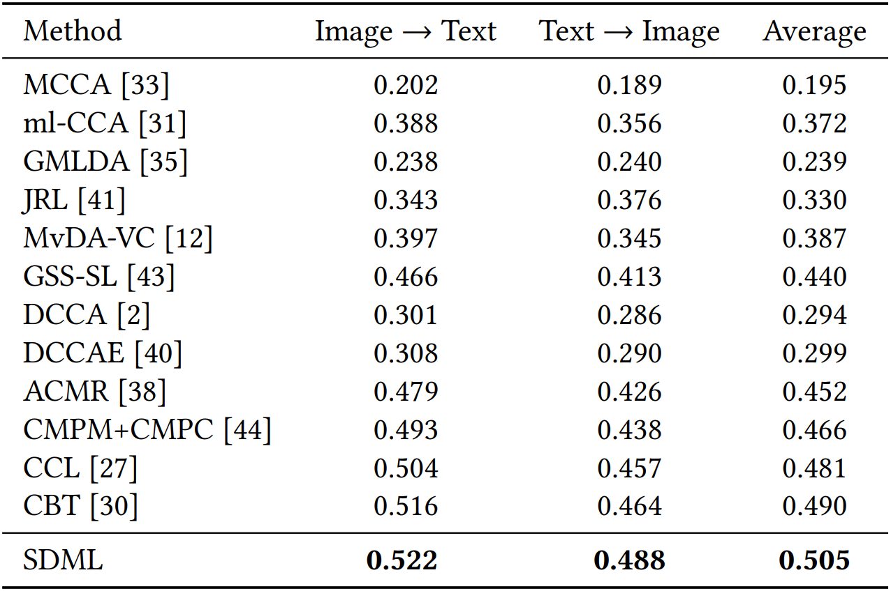
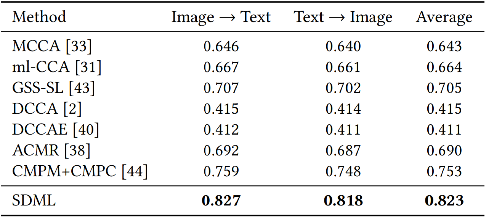

# SDML
Scalable deep multimodal learning for cross-modal retrieval

## Abstract
Cross-modal retrieval takes one type of data as the query to retrieve relevant data of another type. Most of existing cross-modal retrieval approaches were proposed to learn a common subspace in a joint manner, where the data from all modalities have to be involved during the whole training process. For these approaches, the optimal parameters of different modality-specific transformations are dependent on each other and the whole model has to be retrained when handling samples from new modalities. In this paper, we present a novel cross-modal retrieval method, called Scalable Deep Multimodal Learning (SDML). It proposes to predefine a common subspace, in which the between-class variation is maximized while the within-class variation is minimized. Then, it trains $m$ modality-specific networks for $m$ modalities (one network for each modality) to transform the multimodal data into the predefined common subspace to achieve multimodal learning. Unlike many of the existing methods, our method can train different modality-specific networks independently and thus be scalable to the number of modalities. To the best of our knowledge, the proposed SDML could be one of the first works to independently project data of an unfixed number of modalities into a predefined common subspace. Comprehensive experimental results on four widely-used benchmark datasets demonstrate that the proposed method is effective and efficient in multimodal learning and outperforms the state-of-the-art methods in cross-modal retrieval.

## Framework
The general framework of the proposed SDML method. The m modality-specific neural networks (one network for
each modality) can be trained separately since they do not share any trainable parameters.


<!--## Performance comparison in terms of mAP scores on the PKU XMedia dataset.
-->
## Performance comparison in terms of mAP scores on the PKU XMedia dataset.


<!--## Performance comparison in terms of mAP scores on the Wikipedia dataset.
-->
## Performance comparison in terms of mAP scores on the Wikipedia dataset.


<!--## Performance comparison in terms of mAP scores on the MS-COCO dataset.
-->
## Performance comparison in terms of mAP scores on the MS-COCO dataset.


## Citing MAN
If you find MAN useful in your research, please consider citing:
```
@inproceedings{hu2019deep,
  title={Scalable deep multimodal learning for cross-modal retrieval},
  author={Hu, Peng and Zhen, Liangli and Peng, Dezhong and Liu, Pei},
  booktitle={International ACM SIGIR Conference on Research and Development in Information Retrieval (SIGIR)},
  year={2019}
}
```
